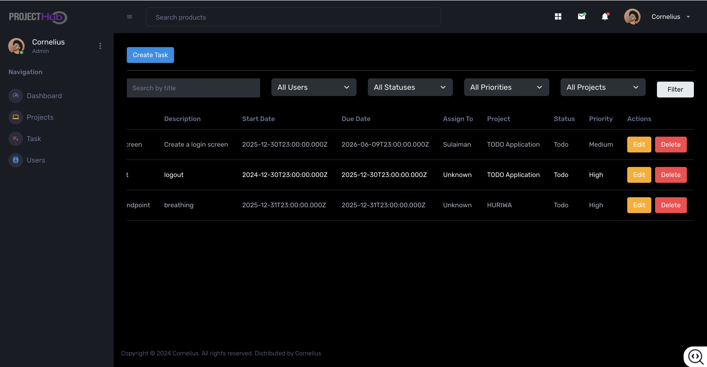

## To demo the application, visit the link below
```bash
http://172.93.51.119/projecthub/
```

## Project Structure

This file dynamically outlines the folder and file structure of the current directory.

```yml
projecthub/
├── .editorconfig
├── .gitignore
├── .vscode/
│   ├── extensions.json
│   ├── launch.json
│   └── tasks.json
├── angular.json
├── package-lock.json
├── package.json
├── src/
│   ├── app/
│   │   ├── app-routing.module.ts
│   │   ├── app.component.css
│   │   ├── app.component.html
│   │   ├── app.component.spec.ts
│   │   ├── app.component.ts
│   │   ├── app.module.ts
│   │   ├── core/
│   │   │   ├── models/
│   │   │   │   ├── project.model.ts
│   │   │   │   ├── task-status.ts
│   │   │   │   └── task.model.ts
│   │   │   └── services/
│   │   │   │   ├── project.service.spec.ts
│   │   │   │   ├── project.service.ts
│   │   │   │   ├── task.service.spec.ts
│   │   │   │   └── task.service.ts
│   │   ├── features/
│   │   │   ├── project/
│   │   │   │   ├── list-projects/
│   │   │   │   │   ├── list-projects.component.css
│   │   │   │   │   ├── list-projects.component.html
│   │   │   │   │   ├── list-projects.component.spec.ts
│   │   │   │   │   └── list-projects.component.ts
│   │   │   │   └── state/
│   │   │   │   │   └── project.store.ts
│   │   │   ├── task/
│   │   │   │   ├── list-tasks/
│   │   │   │   │   ├── list-tasks.component.css
│   │   │   │   │   ├── list-tasks.component.html
│   │   │   │   │   ├── list-tasks.component.spec.ts
│   │   │   │   │   └── list-tasks.component.ts
│   │   │   │   └── state/
│   │   │   │   │   └── task.store.ts
│   │   │   └── users/
│   │   │   │   ├── state/
│   │   │   │   │   └── user.store.ts
│   │   │   │   ├── users.component.css
│   │   │   │   ├── users.component.html
│   │   │   │   ├── users.component.spec.ts
│   │   │   │   └── users.component.ts
│   │   ├── layout/
│   │   │   ├── dashboard/
│   │   │   │   ├── dashboard.component.css
│   │   │   │   ├── dashboard.component.html
│   │   │   │   ├── dashboard.component.spec.ts
│   │   │   │   └── dashboard.component.ts
│   │   │   ├── footer/
│   │   │   │   ├── footer.component.css
│   │   │   │   ├── footer.component.html
│   │   │   │   ├── footer.component.spec.ts
│   │   │   │   └── footer.component.ts
│   │   │   ├── header/
│   │   │   │   ├── header.component.css
│   │   │   │   ├── header.component.html
│   │   │   │   ├── header.component.spec.ts
│   │   │   │   └── header.component.ts
│   │   │   ├── main/
│   │   │   │   ├── main.component.css
│   │   │   │   ├── main.component.html
│   │   │   │   ├── main.component.spec.ts
│   │   │   │   └── main.component.ts
│   │   │   └── sidebar/
│   │   │   │   ├── sidebar.component.css
│   │   │   │   ├── sidebar.component.html
│   │   │   │   ├── sidebar.component.spec.ts
│   │   │   │   └── sidebar.component.ts
│   │   ├── models/
│   │   │   ├── project.model.ts
│   │   │   ├── task.model.ts
│   │   │   └── user.model.ts
│   │   ├── pipes/
│   │   │   └── relative-time.pipe.ts
│   │   └── service/
│   │   │   ├── api.service.spec.ts
│   │   │   └── api.service.ts
│   ├── index.html
│   ├── main.ts
│   ├── proxy.config.json
│   └── styles.css
├── tsconfig.app.json
├── tsconfig.json
└── tsconfig.spec.json

```

## ProjectHub todo application

This is a todo application to create projects, create tasks, add tasks to projects and then assign tasks to users.
---

ProjectHub offers the following core functionalities:

* **Project Management:** Easily create, view, and manage your projects.
* **Task Creation:** Define individual tasks with descriptions and associate them with specific projects.
* **User Assignment:** Assign tasks to registered users for clear accountability.
* **Task Listing:** View all tasks, filter by project, or see tasks assigned to specific users.
* **User Management:** Create and manage user accounts within the application.
* *(Optional: Add more features here, e.g., task status tracking, due dates, search functionality, etc.)*

---

### Install dependencies:** 
``` bash
npm install
```
### Running the Application

To start the development server and run the ProjectHub application locally:

```bash
npm start
```

## Application Screenshots

Here are some visual examples of the application's interface:

### Dashboard


### Create Tasks


### List Tasks


### Projects


### Users


 
